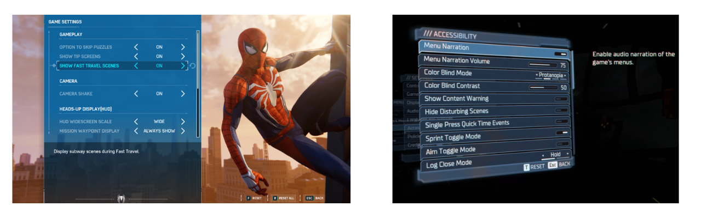

# Software and In-Game Settings

<button onclick="window.print()" class="print-button">
  Printable Version of this Section
</button>

Examples of Software Overlays and Setting Menus

## What are In-Game Accessibility and Additional Software?
**In-game accessibility** refers to the settings and features built directly into a video game by developers. These allow players to customize the visual, auditory, and motor requirements of the game to match their specific needs.

**Additional software** refers to third-party applications that run alongside a game. These programs can "bridge" the gap when a game lacks certain features, such as adding voice control, eye-tracking overlays, or specialized screen reading capabilities.

---

## In-Game Accessibility
Modern game developers are increasingly including robust accessibility menus. These settings can significantly reduce the physical or cognitive load required to play, often making the difference between a game being playable or unplayable.

To find resources on how to pick games with accessibility, visit [How to Pick Games](pick-game.md) to learn more.

### Common Settings
Every game has a different set of accessibility features, and developers may use different names for the same settings or design choice they made to make it accessible to more players. While the **[Accessible Games Initiative](https://accessiblegames.com/accessibility-tags/)** is working to standardize this language, it is important to recognize that settings are designed to address specific barriers across many different needs.

While many physical or motor settings are common, modern games also include features to support players with **low vision, blindness, colorblindness, hard of hearing or d/Deaf needs, cognitive or emotional barriers, and speech or strength and dexterity limitations.**

Below is a list of common accessibility features categorized by the barriers they help remove:

#### Motor, Strength, and Dexterity Settings
* **Input Remapping:** Allows players to rearrange button layouts to better suit their physical reach.
* **Toggle vs. Hold:** Converts actions requiring sustained pressure (like holding a trigger to aim) into a single press.
* **Sensitivity Adjustments:** Increases or decreases how much the game reacts to a joystick or mouse movement, helpful for players with limited range of motion or tremors.
* **Game Speed Adjustment:** Slows down the entire game to give players more time to react and process information.
    * Also great for those with cognitive barriers.
* **Playable without Rapid Button Presses:** Removes "button mashing" requirements or Quick Time Events (QTEs).

#### Vision and Colorblind Settings
* **High Contrast Mode:** Simplifies the game's visuals, often highlighting characters and interactive objects in bright, solid colors against a dark background for **low vision or blind** players.
* **Screen Reader/Narration:**
* **Colorblind Filters:** Adjusts the game's color palette specifically for Protanopia, Deuteranopia, or Tritanopia to ensure critical information (like health bars or enemy teams) is distinguishable.
* **Text-to-Speech (TTS):** Narrates on-screen text, menus, and HUD elements for players with visual impairments.
* **Adjustable Text Size:** Increases the scale of subtitles and menu text for easier readability.

#### Hearing and Speech Settings
* **Subtitles and Captions:** Provides text for dialogue and, importantly, **directional captions** for environmental sounds (like footsteps or explosions) for **hard of hearing or d/Deaf** players.
* **Visual Cues:** Uses light or screen shakes to represent sounds that occur off-screen.
* **Speech-to-Text (STT):** Transcribes the voice chat of other players into text, allowing players to communicate without relying on audio.

#### Cognitive, Emotional, and Difficulty Settings
* **Difficulty Scaling:** Allows players to adjust enemy health, damage, or AI behavior to reduce the cognitive or reactionary load.
* **Game Speed Adjustment:** Slows down the entire game to give players more time to react and process information.
* **Wayfinding and Hints:** Provides clear visual paths or markers to the next objective to assist with navigation and memory.
* **Safe Modes:** Some games include settings to remove "emotional" triggers, such as disabling spiders (Arachnophobia mode) or reducing intense gore and flashing lights.

Here is a great talk from Alex Carey, founder of [PlayAbility Consultancy,](https://www.play-ability.net/) showing examples of features for each of the above described barriers:
  

    <iframe src="https://www.youtube.com/embed/8UtY8QHDmw0?si=uDYTihPeFDmrjAH5" frameborder="0" allowfullscreen></iframe>

### Accessibility by Design
Some studios, like **Ubisoft**, lead the field by integrating accessibility into core design rather than as an afterthought. For example, in titles like *Far Cry* or *Assassin’s Creed*, they provide "Vision Packs" and "Motor Packs" that pre-configure groups of settings to help players get started quickly based on their specific disability profile.

These studios also think about accessibility outside of menus. For instance, a game might differentiate "Rare" vs. "Common" loot not just by color, but by unique shapes or icons so that a colorblind player can identify them at a glance without ever opening a settings menu.

---

## Additional Software
When the built-in settings aren't enough, third-party software can provide a custom layer of control. These tools often translate one type of input (like a voice command) into something the game understands (like a keyboard press).

### Screen Readers
For gamers who are blind or have low vision, screen reading software is essential. 

* **Built-in Platform Readers:** Tools like **Narrator** (Windows), **VoiceOver** (iOS), and the native screen readers on Xbox and PlayStation can read out system menus and, in compatible games, in-game text and UI elements.
* **OCR Tools:** Some specialized software uses Optical Character Recognition (OCR) to "read" text appearing on the screen in real-time for games that do not natively support screen readers.

### Other Notable Software
* **Voice Control, Eye Tracking, and Gesture Control:** These are all covered in detail in the [Alternative Access Section under "Other Input Methods"](alt-access.md#other-input-methods).
* **Remapping Suites:** Programs like [**reWASD**](https://www.rewasd.com/) or the settings within **Steam** can provide much deeper remapping capabilities than standard game menus, allowing for "chorded" presses (triggering one action by pressing two buttons simultaneously) and advanced deadzone tuning for joysticks.