# Alternative Access

<button onclick="window.print()" class="print-button">
  Printable Version of this Section
</button>

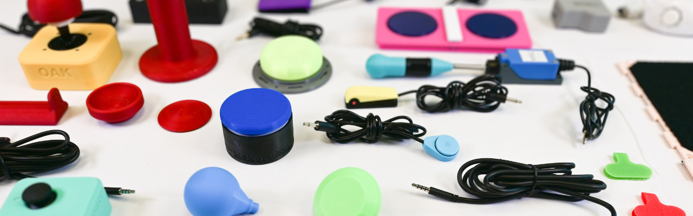

Various MMC Assistive Switches and Joysticks

## What is Alternative Access
Alternative Access referes to using any type of input into a game that does not involve using a "standard controller". In this case "standard controller" means the default controls that come with the system. This could be keyboard/mice or Xbox/Nintendo/PlayStation controllers. 

There are various categories of devices and tools under alternative access: 

* Using Adaptive Controllers
    * Assistive Switches
    * Assistive Joysticks
* Specialized Controllers
* Other Input Methods
    * Eye Tracking
    * Voice Control
    * Facial and Body Gestures
* Important Considerations
    * Adapters
    * Mounting

This section will provide an overview on all the devices and tools mentioned above as well as giving a quick overview of the platforms available.

---

## Adaptive Controllers
For the purpose of this resource, we are going to define adaptive controllers as anything built or designed for gaming platforms that either take a significantly different shape and/or allow assistive switch and/or joystick access.

There are three primary adaptive controllers out there with various approaches to making gaming more accessible. We like to divide them into **Hub Based Controllers** or **Direct-Use Controllers**. The difference is: 

* **Hub Based Controllers:** Require other assistive technology to be plugged into it to create a setup. This is just the bridge between the assistive technology and the platform you are trying to game on.
* **Direct-Use Controllers:** Designed to be used without or with little addition of other assistive technology. The controller often takes a significantly different shape than the standard controller and has various joysticks and buttons built into it.

Other Adaptive Controllers
 

| Controller | Visual Reference | Approx Cost (CAD) | Category & Compatibility* | Key Features & Technical Details |
| :--- | :--- | :--- | :--- | :--- |
| **[Xbox Adaptive Controller (XAC)](https://www.xbox.com/en-CA/accessories/controllers/xbox-adaptive-controller)** | 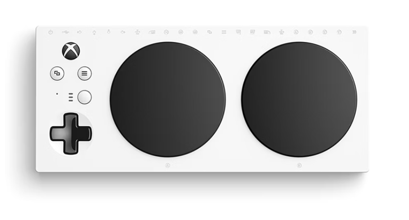 | $129.99 | **Type:** Mostly Hub Based  **Compatibility:** Natively compatible with Xbox One, Xbox Series X\|S, computers, and phones/tablets. | 

<b>Show Detailed Info</b>
<ul><li>Hub based with enough buttons on the device out of the box to navigate the menu and play very simple games.</li><li>Most users will have to get additional assistive technology such as switches, joysticks, and mounting to create a custom setup.</li><li>You can plug in USB joysticks or joysticks that use 3.5 mm cables. Assistive switches can be plugged in as well if they have a 3.5 mm cable.</li><li>Uses the Xbox Accessories App (available on PC or Xbox) to remap and customize the inputs of the buttons. This allows it to be used as a gaming device or keyboard/mouse.</li></ul>
 |
| **[Sony Access Controller (SAC)](https://www.playstation.com/en-ca/accessories/access-controller/)** | 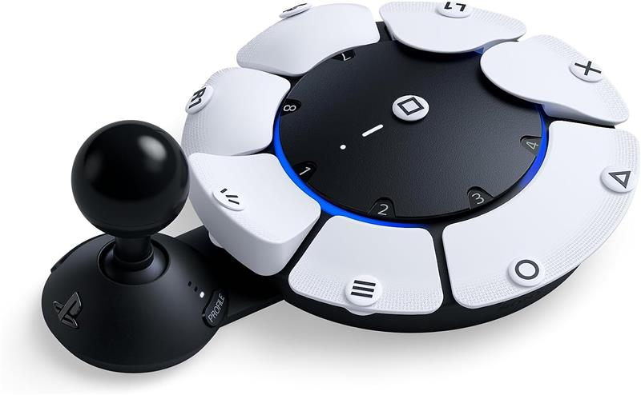 | $99.97 |**Type:** Mostly Direct-Use  **Compatibility:** ONLY compatible with the PS5 natively. | 

<b>Show Detailed Info</b>
<ul><li>Direct-Use controller with a built in joystick and circular array of buttons that can be remapped.</li><li>This also features 4 expansion ports that joysticks or switches with a 3.5 mm cable can plug into. No built in USB joystick compatibility. However, there are alternatives explained in the Sony Access Controller section.</li><li>Uses the settings inside of the PS5 to remap and customize the inputs of the buttons.</li></ul>
 |
| **[Hori Flex Controller](https://stores.horiusa.com/flex-controller-for-nintendo-switch/)** | 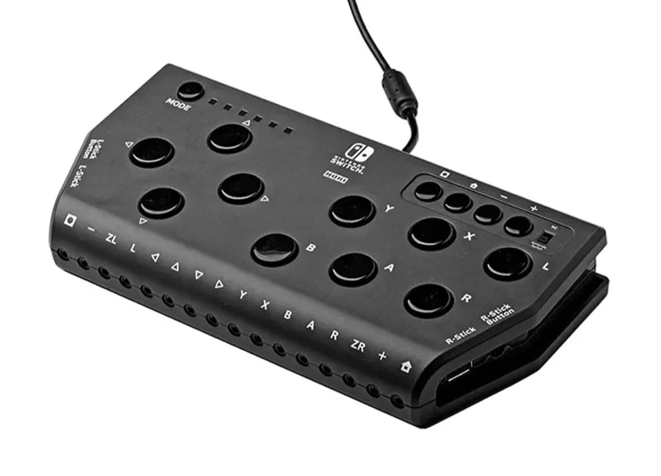 | $440.00 | **Type:** Hybrid (Hub/Direct-Use Mix)  **Compatibility:** Connects to Nintendo Switch 1 and 2 natively. | 

<b>Show Detailed Info</b>
<ul><li>A mix between the Hub Based and Direct-Use controller approach. It has various 3.5 mm ports and two USB ports for joysticks (no 3.5 mm joystick access) but also an array of buttons on the top of the controller.</li><li>Has functionality to work with some eye tracking technology.</li></ul>
 |

*Compatibility in this table is only referring to what the device was designed to connect with. However, you can use adapters to get these adaptive controllers to connect to nearly any platform. See the adapters section</a>.

    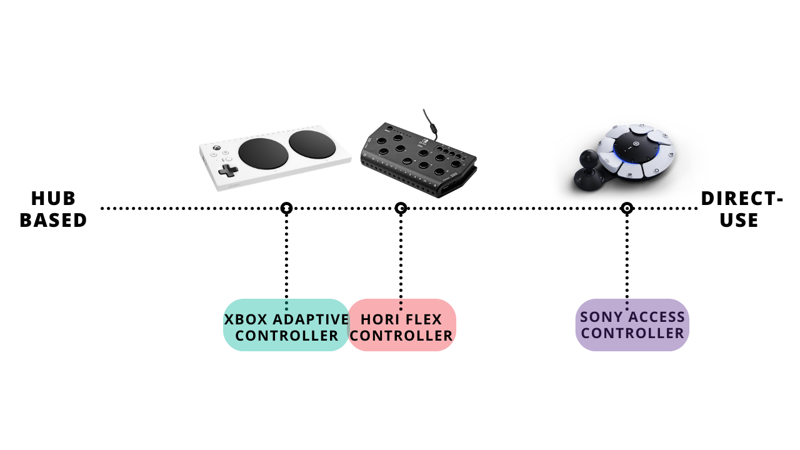
    
Spectrum of Hub Based and Direct-Use Based Adaptive Controllers

**See each section below for more specific information on the adaptive controllers.**

### Xbox Adaptive Controller (XAC)

    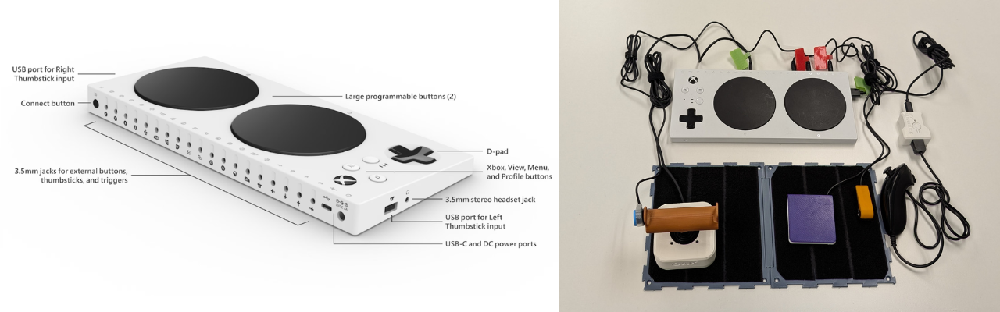

Released in 2018 with ongoing updates (even today), the Xbox Adaptive Controller (XAC) is a very powerful device with many applications. It could even be used as a bridge to use assistive technology to access a computer for personal use or employment. The XAC features some buttons on its face for usage out of the box but also has 3.5 mm and USB ports to add more assistive technology. Acting as a hub to create a custom adaptive gaming setup.

#### How to Get Started
Xbox has a fantastic series of videos and online resources explaining every feature on the XAC alongside player profiles where players using the XAC describe their setup.

<a href="https://support.xbox.com/en-US/help/account-profile/accessibility/xbox-adaptive-controller" 
   target="_blank" 
   class="print-button">
   Check out the XAC Resources Created by Xbox
</a>

  
  
Scan to go to the XAC web resources created by Xbox

Check out the first video in Xbox's resource series here:

    <iframe 
        src="https://www.youtube.com/embed/zd4VddU1wTQ?list=PLGr-X28QXcrsMqFQNQGFlzQmrdMPKXjf2" 
        frameborder="0" 
        allow="accelerometer; autoplay; clipboard-write; encrypted-media; gyroscope; picture-in-picture" 
        allowfullscreen>
    </iframe>

  
  
Scan to go to the Video XAC resources created by Xbox

SpecialEffect also has a fantastic walkthrough of setting up an XAC on an Xbox Console: 

    <iframe src="https://www.youtube.com/embed/n4WICsictO0" frameborder="0" allowfullscreen></iframe>

    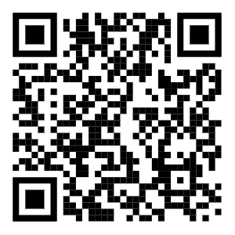
    
Scan to go to the SpecialEffect XAC Setup

#### Key Features

Key Features of the Xbox Adaptive Controller (XAC)
 

| Feature | What Does it Do | Use Case | Learn More |
| :--- | :--- | :--- | :--- |
| **Assistive Switches and Joysticks** | • The main feature of the XAC is being able to plug in 3.5 mm assistive switches and 3.5 mm or USB joysticks to create a custom setup | • If the built in buttons do not work for the player or they need additional input. | Found in: [Video: XAC Guide - Getting Started](https://youtu.be/zd4VddU1wTQ?si=pKEhQ30Cf0V35zft&t=295) |
| **Controller Remapping** | • Each 3.5 mm port on the back of the XAC is labeled with a specific input. For example, you plug in an assistive switch to the A port, it will act as A.  • However, you can use the Xbox Accessories App to reassign (remap) that button to any button or action available in the Xbox.  | • You want to use the features such as toggle, shift, axis swap, etc. that are available in the Xbox Accessories App. You would set this up through the remapping process and save it. | Found in: [Video: XAC Guide - Customization with the Xbox Accessories App](https://youtu.be/l73APLDxP1c?si=Nje4XIzBbI6t_i92&t=111) |
| **Profile Saving** | • You can save various remapping settings you have made for various games  • You can save as many profiles as you want but you can only save 3 to the controller at a time to hotswap between. There is a button on the XAC to swap between the three profiles that can also be accessed by an assistive switch.  | • You play a racing game, fighting game, and first person shooter. Instead of unplugging and replugging or remapping all the time, you can save the profile that works for that game once.  | Found in: [Video: XAC Guide - Customization with the Xbox Accessories App](https://youtu.be/l73APLDxP1c?si=mrOs_iFqMSdFT7lV&t=353) |
| **Controller Assist (previously co-pilot)** | • This allows two controllers to act as one. Either two XAC's, standard controllers, or a standard controller and an XAC working together. | • One player does some of the inputs with the standard controller while the other uses the custom setup with the XAC to use those inputs. | Found in: [Video: XAC Guide - Getting Started](https://youtu.be/zd4VddU1wTQ?si=pKEhQ30Cf0V35zft&t=295) |
| **Button Toggle** | • You can assign any button input to stay activated with a single press. Then press again to turn off. Think about a light switch. | • For users that do not want to hold a button down to keep it activated. Aiming in first person shooter games is a great example. Press once to aim, press again to put the weapon down. | Found in: [Video: Gaming Readapted](https://youtu.be/peQryhh6aOw?si=3KyE7LBvb4FEY1G-&t=160) |
| **Shift Mode** | • Shift allows you to assign two different functions to a single joystick or button.| • You must choose an input (button or joystick) to make your shift button  • The Shift key also allows you to assign two different functions to a single button. You can remap a button to be the A button A by default, but when holding the Shift key, your A button now functions as the B button when you press it.  | [Video: XAC Guide - Advanced functionalities](https://youtu.be/VuomjNhHYew?si=iLxLnji9b8kusAJx&t=41) |
| **Joystick Axis Swap** | • When remapping, if you select one of the joysticks it will allow you to swap either or both the X and Y axis. | • This allows the gamer to play a game that requires 2 joysticks with one.  • For example, if they were using a left joystick and swapped the X axis with the right joystick, they could move forward and back in a 3rd person game and use the left and right to look around and move in all directions. | n/a - No resource yet |
| **Joystick Sensitivty Curves** | • Adjusting the sensitivity of the joystick plugged into the XAC. | • For example, players who have limited strength or mobility can choose a sensitivity curve option that provides an experience where less physical movement of the joystick is needed to achieve the same amount of in-game character or camera movement. | [Video: XAC Guide - Advanced functionalities](https://youtu.be/VuomjNhHYew?si=NKKxagPeL2qmLz2Q&t=243) |
| **Mounting** | • 1/4-20 screw designed for AMPS compatible mounts. °-20 screw designed for tripod mounts. | • Placeing the controller in a more optimal position for the player | N/A |

### Sony Access Controller (SAC)

    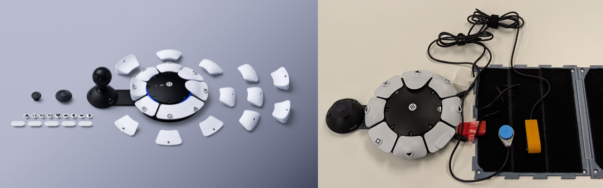

Released in 2023, the Sony Access Controller took a different approach to the adaptive controller than both the XAC and Hori Flex Controller by attempting to create an out-of-the-box ready to play adaptive controller. This is a great option for some players but in other ways, its lack of customization in shape and limited amount of ports for additional assistive tech may not be enough for some. 

#### How to Get Started
PlayStation has a fantastic series of videos and online resources explaining every feature on the SAC. The SAC also does a great job of walking the player through using the controller during first setup/launch on the system. This is by far the most intuitive adaptive controller. 

<a href="https://www.playstation.com/en-ca/support/hardware/accessories/?category=access&subCategory=parts" 
   target="_blank" 
   class="print-button">
   Check out the SAC Resources Created by PlayStation
</a>

  
  
Scan to go to the SAC web resources created by PlayStation

Check out the SAC setup and unboxing video:

    <iframe src="https://www.youtube.com/embed/cYHdXMPC94g" frameborder="0" allowfullscreen></iframe>

    
    
Video: SAC Setup and Unboxing

Check out the SAC controller customization video:

    <iframe src="https://www.youtube.com/embed/jQTnuYbzgnE" frameborder="0" allowfullscreen></iframe>

    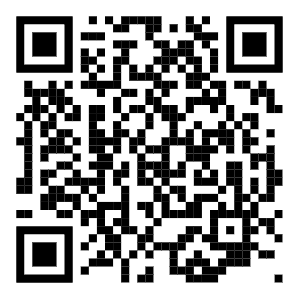
    
Video: SAC Controller Customization

#### Key Features

Key Features of the Sony Access Controller (SAC)
 

| Feature | What Does it Do | Use Case | Learn More |
| :--- | :--- | :--- | :--- |
| **Swappable Button Caps** | • The SAC comes with various cap shapes (pillow, flat, curved, and overhang) that magnetically attach to the buttons. • Includes a "wide flat" cap that can cover two button sockets at once. | • A user needs a larger target area for a specific action. • Use the overhang caps for players who find it easier to pull a button rather than push it. | [Button Caps Resource](https://www.playstation.com/en-ca/support/hardware/customize-access/) |
| **Built-in Joystick** | • A built-in analog stick that can have the cap swapped (standard, dome, or ball) and the arm length adjusted. • The orientation is 360° adjustable; you can set "North" to be any direction via the PS5 settings. | • A player is mounting the controller at an angle or upside down and needs the stick to still respond correctly to "Up/Down" movements. • Adjust the arm length to meet the player's reach. | [Built-in Joystick Resource](https://www.playstation.com/en-ca/support/hardware/customize-access/) |
| **Expansion Ports** | • A total of four 3.5 mm expansion ports allowing for assistive switch or joystick (no USB) access • Up to four assistive switches or up to 2 joysticks | • If the built in joysticks or buttons do not work for the player or they need additional input. | [Expansion Ports Resource](https://www.playstation.com/en-ca/support/hardware/access-expansion/) |
| **Secondary Controller** | • Allows up to three controllers to be paired as a single controller. This can include two Access controllers and one DualSense wireless controller. • All connected controllers can be used simultaneously to navigate menus and play games. | • A secondary user uses a DualSense controller to handle complex movements (like camera control) while the player uses one or two SACs for primary actions. • Two Access controllers are used together to create a full 360-degree button layout for a single player. | [Secondary Controller Resource](https://www.playstation.com/en-ca/support/hardware/connect-multiple-access/) | 
| **Controller Remapping** | • Software-level customization that allows you to change what every physical button does on the PS5 system. • Allows for disabling buttons entirely to prevent accidental presses. | • You need to move a vital function (like R2) from a trigger to a large, accessible button on the SAC deck. • Simplify a game by removing unused inputs that might cause frustration. | [How to set Access Controller Mapping](https://www.playstation.com/en-ca/support/hardware/access-profiles/#assign) |
| **Profile Saving** | • You can save various remapping settings you have made for various games. • You can save as many profiles as you want but you can only save 3 to the controller at a time to hotswap between. There is a button on the SAC to swap between the three profiles that can also be accessed by an assistive switch. | • You play a racing game, fighting game, and first person shooter. Instead of unplugging and replugging or remapping all the time, you can save the profile that works for that game once. | [How to set Access Controller Mapping](https://www.playstation.com/en-ca/support/hardware/access-profiles/#assign) |
| **Simultaneous Press** | • Allows a single physical button to act as two button presses at the same time (e.g., L1 + R1). • The wide flat button cap can also be used to physically bridge two separate button sockets. | • Useful for fighting games or shooters where "Ultimate" abilities require pressing two buttons simultaneously. • Helps users with limited coordination who struggle to hit two separate targets at once. | [How to set Access Controller Mapping](https://www.playstation.com/en-ca/support/hardware/access-profiles/#assign) |
| **Button Toggle** | • You can assign any button input to stay activated with a single press. Then press again to turn off. Think about a light switch. | • For users that do not want to hold a button down to keep it activated. Aiming in first person shooter games is a great example. Press once to aim, press again to put the weapon down. | [How to set Access Controller Mapping](https://www.playstation.com/en-ca/support/hardware/access-profiles/#assign) |
| **Joystick Sensitivity and Deadzone** | • Adjusts how much physical movement is required to trigger an in-game action. • Deadzone settings allow you to tell the console to ignore small, accidental "drifts" or tremors. | • A player has very limited range of motion and needs the stick to be "highly sensitive" so a small twitch results in a full movement. • A player with tremors needs a larger "deadzone" so the camera doesn't shake. | [How to set Access Controller Mapping](https://www.playstation.com/en-ca/support/hardware/access-profiles/#assign) |
| **Mounting** | • Two 10-24 screw holes for securely attaching the controller to mounts with an AMPS hole pattern. • One 1/4-20 hole located near the center of the controller to mount the controller to tripods or any mounts compatible with this screw hole. | • Placing the controller in a more optimal position for the player, such as on a wheelchair tray or a camera tripod. | [Mounting Resource](https://www.playstation.com/en-ca/support/hardware/access-mount/) |

    
    
Video: SAC Controller Customization

    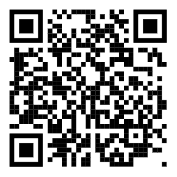
    
Video: SAC Expansion Ports

    
    
Video: SAC Secondary Controller

    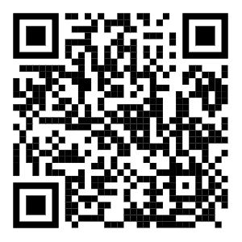
    
Video: SAC Controller Mounts

### Hori Flex Controller

    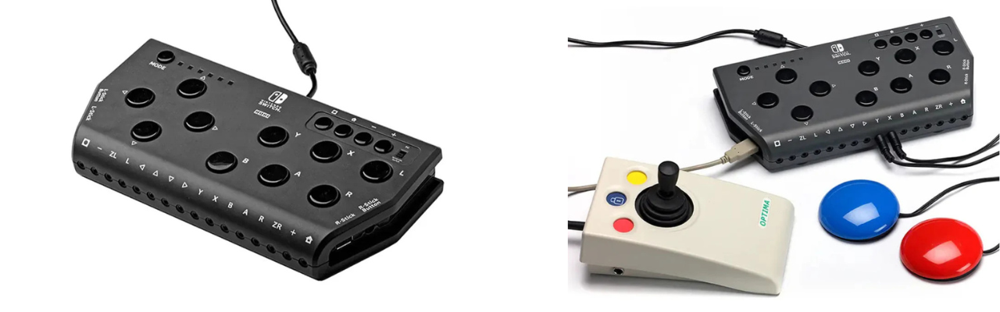

The Hori Flex is a unique hybrid controller designed primarily for the Nintendo Switch (though it is also compatible with PC). It bridges the gap between the XAC and the SAC by offering a significant number of built-in buttons on the top of the device while still providing 3.5 mm ports for external switches and USB ports for joysticks. Notably, it is the only major adaptive controller that offers dedicated eye-tracking accessibility features right out of the box.

#### How to Get Started
Hori provided a detailed manual and others like SpecialEffect and Gaming Readapted have made fantastic video tutorials.

<a href="https://hori.jp/manual/nsw/nsw-280/" 
   target="_blank" 
   class="print-button">
   Download the Hori Flex Controller Manual
</a>

    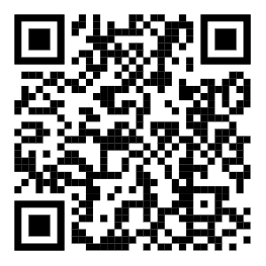
    
Link: Hori Flex Manual

Check out the SpecialEffect Hori Flex introduction and setup guide:

    <iframe src="https://www.youtube.com/embed/zak38eFZVm8?si=3XsJeCgceoZTgHNb" frameborder="0" allowfullscreen></iframe>

    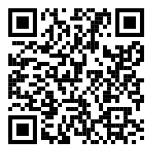
    
Video: SpecialEffect Hori Flex Setup

Gaming Readapted also provides a great overview of how the Hori Flex integrates with the Nintendo Switch:

    <iframe src="https://www.youtube.com/embed/--b-TqNJz2g?si=35V_6DuYOjlMcbbD" frameborder="0" allowfullscreen></iframe>

    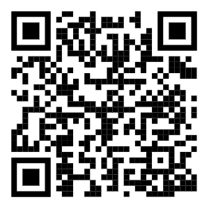
    
Video: Gaming Readapted Hori Flex Setup

#### Key Features

Key Features of the Hori Flex Controller
 

| Feature | What Does it Do | Use Case | Learn More |
| :--- | :--- | :--- | :--- |
| **Hybrid Input Design** | • Features 18 assignable 3.5 mm switch ports and 2 USB ports for joysticks (no 3.5 mm). • Includes a small array of physical buttons on the face of the device for direct use. | • A user needs the "Hub" capability of the XAC but also wants a few physical buttons on the device for menu navigation or simple actions. | [SpecialEffect - Hori Flex](https://www.youtube.com/embed/zak38eFZVm8?si=3XsJeCgceoZTgHNb) |
| **Eye-Tracking Interface** | • Features a dedicated interface that allows the controller to be operated via compatible eye-tracking devices on the PC. | • For players with very limited physical mobility who rely on eye-gaze technology to interact with their environment and games. | [SpecialEffect - Hori Flex](https://www.youtube.com/embed/zak38eFZVm8?si=3XsJeCgceoZTgHNb) |
| **Flex Controller Settings App** | • A dedicated PC application used to remap buttons, adjust joystick sensitivity, and configure deadzones. | • You need to customize the "active" range of a joystick or change the behavior of a specific switch port for a Nintendo Switch game. | [SpecialEffect - Hori Flex](https://www.youtube.com/embed/zak38eFZVm8?si=3XsJeCgceoZTgHNb) |
| **On-Board Profile Storage** | • Allows you to store multiple mapping configurations directly on the hardware. • Profiles can be toggled using a physical button on the controller. | • A user frequently switches between games like *Mario Kart* and *The Legend of Zelda* and needs instant access to different button layouts. | [SpecialEffect - Hori Flex](https://www.youtube.com/embed/zak38eFZVm8?si=3XsJeCgceoZTgHNb) |
| **Mounting** | • Features a standard 1/4-20 threaded hole on the bottom of the device. | • Securely mounting the controller to a camera tripod or a magic arm for positioning near the head or lap. | [SpecialEffect - Hori Flex](https://www.youtube.com/embed/zak38eFZVm8?si=3XsJeCgceoZTgHNb) |

    
    
Video: SpecialEffect Hori Flex Setup

???+ warning "Cost Consideration"
    The Hori Flex controller is significantly more expensive than the other options. With the XAC providing very similar functions, compatibility with more devices (phones and computers), and a more dynamic remapping and customization software, consider purchasing an XAC with an adapter that allows it to connect to a Nintendo Switch 1 or 2. 

    However, if the player wants eye tracking software compatibility specifically, that may shift the decision to the Hori Flex Controller.

### Other Adaptive Controllers
There are also a few other adaptive controllers out there. These typically only connect to phones and computers for gaming. This resource only touches on these briefly but see the table below for a few of the key options out there. The main reason someone may consider these options over the XAC, SAC, or Hori Flex is potentially due to reduced cost or customization available if they are open source and allow the user to customize the programming of the device.

Comparison of Adaptive Controllers
 

| Controller | Visual Reference | Approx Cost (CAD) | Category & Compatibility* | Key Features & Technical Details |
| :--- | :--- | :--- | :--- | :--- |
| **[Forest Hub](https://www.makersmakingchange.com/product/forest-joystick-mouse-hub/01tJR000000E4bdYAC)** |  | ~$75-150 | **Type:** Hub Based  **Compatibility:** Natively compatible with PC, tablets, and phones. Can be connected to XAC through left or right USB port. | • Enables a user to connect an analog joystick (TRRS) and up to four (4) assistive switches to emulate a USB Mouse or USB Gamepad. Another assistive switch can be used to cycle between slots and switch between Mouse and Gamepad mode. |
| **[Quester Switchbox](https://www.pretorianuk.com/quester-switchbox/)** |  | ~$265.00 | **Type:** Hub Based  **Compatibility:** Natively compatible with conputers and Android mobile devices. Works with Xbox via XAC USB ports. | • A "plug-and-play" interface that converts up to six (6) assistive switches into standard gamepad or mouse inputs. • Features an integrated display to show the current mode and requires no external software for configuration, making it ideal for clinical environments with restricted IT/software installation rights. |
| **[HID Remapper](https://www.remapper.org/)** |  | N/A - Depends on the type of remapper and manufacturing costs | **Type:** Universal Adapter / Hub  **Compatibility:** Broad; connects almost any USB input device to PC, consoles (via adapters), and mobile. | • A powerful open-source tool that allows for hardware-level remapping of any USB HID device. It can combine multiple controllers into one or split one controller across several outputs. • Supports advanced logic like macros, layers, and custom sensitivity curves stored on the hardware, bypassing the need for background software. |

*Compatibility in this table is only referring to what the device was designed to connect with. However, you can use adapters to get these adaptive controllers to connect to nearly any platform. See the adapters section</a>.

---

## Specialized Controllers
The distinction between Specialized Controllers and Adaptive Controllers is that adaptive controllers often act as a "hub" or intermediary between assistive technology and a platform. In contrast, specialized controllers are designed from the ground up with a specific form factor or function in mind. For example, to allow for one-handed use, modular building, or ultra-low-force interaction, etc.

### Byowave Proteus
The Proteus is a modular, "snap-and-play" controller system. It uses magnetic cubes and peripheral parts that allow a user to build a controller in whatever shape they need. 

<a href="https://byowave.com/" 
   target="_blank" 
   class="print-button">
   Check out the Byowave Controllers
</a>

| Controller | Visual Reference | Key Features |
| :--- | :--- | :--- |
| **Proteus Controller / Builder** |   | • **Modular Design:** Snap magnetic modules together to create unique shapes. • **Akimbo Mode:** A firmware update that allows two separate Proteus "Power Cubes" to work together as a single controller on one USB dongle. • **Compatibility:** Works natively with Xbox, PC, and Steam Deck. |

### Nhuad One Handed Controller
* One handed Khuan controller - https://nhuadcontrollers.com/

### Azeron Controllers
* azeron controller types - https://azeron.com/?srsltid=AfmBOorIwKsCeFy0NbSXzBpbhI_NisV2JBW-x7TOOJdKH6_1RmRRUI-n

### 8Bit-Do Lite SE
* 8Bit-Do  https://www.8bitdo.com/lite-se/ 

---

## Assistive Tech for Adaptive Controllers
The adaptive controllers above all allow for some amount of additional assistive tech to be connected and used as an input in the game. These are often (but not limited to) assistive switches and joysticks. Think of these the same as the buttons and thumbsticks on a standard controller but coming in a variety of shapes, sizes, forces, and types of activation.

Finding assistive technology that works for the player but also the adpative controller/platform you are playing on is crucial. **Below are some resources to explain using assistive tech with adaptive controllers and where to find them.**

### Assistive Switches

    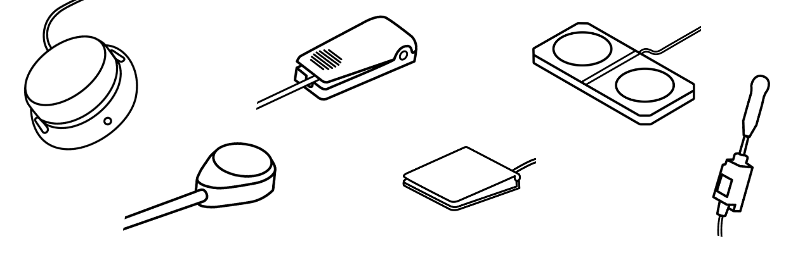

Assistive switches act as the primary bridge between a user’s physical movement and a digital action. At their core, they are simply external buttons that can be mounted in a convenient location for the user, targeting whichever part of the body has the most reliable and comfortable range of motion. Most assistive switches utilize a standard 3.5 mm cable to connect to adaptive controllers or switch interfaces.

In a gaming context, these switches replace the physical buttons on a standard controller or keyboard that may be inaccessible to the player. By using a combination of these external "access points" a gamer can reliably and comfortably trigger any in-game input, from jumping to firing a weapon, using the movements that work best for them.

    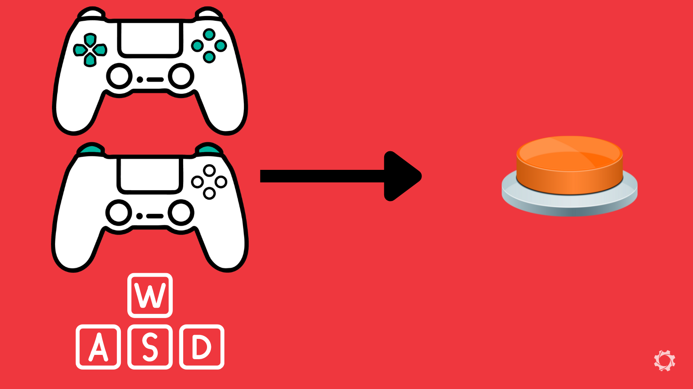
    
Keyboard or Controller Buttons can be Swapped to Buttons

Here are the criteria that often seperates the assistive switch options out there:

* **Activation Force:** The amount of pressure (measured in grams) required to "click" the switch.
* **Target Shape:** The switch activation area can have a smooth or specific tactile surface, curve, or custom shape.
* **Target Size:** The surface area available to hit; larger targets assist gross motor movements, while smaller targets allow for precise mounting.
* **Travel Distance:** How far the switch must physically move before it activates.
* **Feedback:** Whether the switch provides a tactile "click" or an audible sound to confirm the button was pressed.
* **Mounting Type:** How the switch attaches to the environment (e.g., threaded inserts for arms or flat bases for Velcro).

Below are some links to various places you can get assistive switches. Depending on where you live, there may be more options available. This is just a basic list of common places we use to get you started to find options out there.

#### Open Source/DIY Options
These options have been released under an open source license. This means anyone should have access to the files to build and create this device. 

Assistive Switch - OpenAT Options
 

| Organization/Device | Description | Link |
| :--- | :--- | :--- |
| **Device/Org** | •  | [link]() |
| **Device/Org** | •  | [link]() |
| **Device/Org** | •  | [link]() |
| **Device/Org** | •  | [link]() |
| **Device/Org** | •  | [link]() |

#### Commercial Options
* Summary

Assistive Switch - Commercial Options
 

| Organization/Device | Description | Link |
| :--- | :--- | :--- |
| **Logitech Adaptive Gaming Kit** | •  | [View Device](https://www.logitechg.com/en-ca/shop/c/gamepads-controllers) |
| **Device/Org** | •  | [link]() |
| **Device/Org** | •  | [link]() |
| **Device/Org** | •  | [link]() |
| **Device/Org** | •  | [link]() |

### Assistive Joysticks

    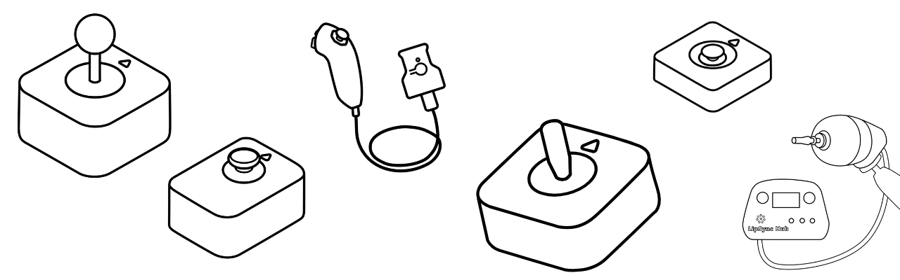

Assistive joysticks provide a way to replicate the directional movement usually found on a standard controller's thumbsticks. While a standard joystick is fixed to the controller, an assistive joystick can be positioned independently to be used by the hand, foot, chin, or any other reliable point of movement. These devices translate physical movement into digital "X and Y" coordinates, allowing the player to move their character or control the camera in-game.

In gaming, assistive joysticks typically connect via a USB cable **OR** a 3.5 mm cable.

    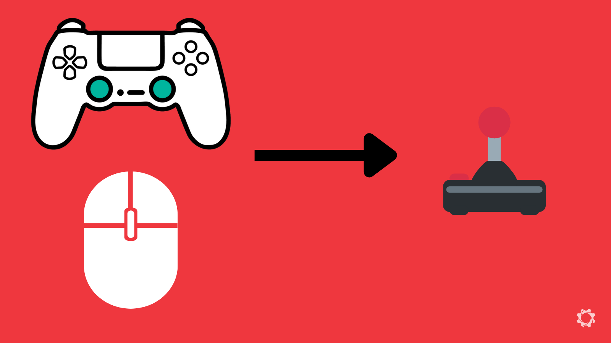
    
Mice or Controller Joysticks can be Swapped to Assistive Joysticks

Here are the criteria that often separate the assistive joystick options out there:

* **Force Required:** The amount of physical strength needed to move the stick from the center position. Some "low force" sticks can be moved with a feather-touch, while others offer more resistance.
* **Range of Motion (Throw):** The distance the joystick must physically tilt to reach to provide input in the game.
* **Digital vs. Analog:** 
    * Analog: Responds to how far you push; move a little to walk, move a lot to run. Proportional control in all directions.
    * Digital: Responds only to direction (like a D-pad); it is either "on" or "off.". Some work in 4 directions (up, down, left, right) and some work in 8-way (up, down, left, right, and the 4 diagonals)
* **Topper Style:** The physical shape of the handle (e.g., ball top, goalpost, or dome) which may be able to be swapped to match the user's prefered grip.
* **Input Connection:** Whether it uses a USB plug for direct-use/hubs or a 3.5 mm jack for specific adaptive ports.
* **Mounting Type:** How the base is secured, such as 1/4-20 threaded inserts for mounting arms, hook and loop, etc.

Below are some links to various places you can get assistive joysticks. Depending on where you live, there may be more options available. This is just a basic list of common places we use to get you started to find options out there.

#### Open Source/DIY Options
These options have been released under an open source license. This means anyone should have access to the files to build and create this device. 

Assistive Joystick - OpenAT Options
 

| Organization/Device | Description | Link |
| :--- | :--- | :--- |
| **Device/Org** | •  | [link]() |
| **Device/Org** | •  | [link]() |
| **Device/Org** | •  | [link]() |
| **Device/Org** | •  | [link]() |
| **Device/Org** | •  | [link]() |

#### Commercial Options
* Summary

Assistive Joystick - Commercial Options
 

| Organization/Device | Description | Link |
| :--- | :--- | :--- |
| **Device/Org** | •  | [link]() |
| **Device/Org** | •  | [link]() |
| **Device/Org** | •  | [link]() |
| **Device/Org** | •  | [link]() |
| **Device/Org** | •  | [link]() |

---

## Other Input Methods
* Summary

### Eye Tracking
* Summary

#### Computer
* adaptive hacker khan videos - millmouse and iris
* special effect games

#### Console 
* hori flex 

### Voice and Gesture Control
* new way to have xac do facial recognition
* Cephable

--- 

## Important Considerations
Twu crucial considerations when creating an alternative access setup are mounting and adapters. If you have all the perfect gear, but no way to securly **mount** it in a useful location for the player, it is practically useless. Also, if you have all the right gear and mounted but it is not compatible with the platform you are playing on, **adapters** can be useful.

### Mounting
* summary

#### Hook and Loop
* Summary
* DIY version and now our MMC version

#### Articulating arm
* summary

#### RAM
* ablegamers adapters

### Adapters
* summary/why is this important
* Look at gaming readapted as the primary resource but also note that things go out of date.

## How to choose what works for you?
* Difficult without trying it. Try to find somewhere to try stuff. if not, rule out what for sure does not look like it will work. 
* submit a gaming ticket
