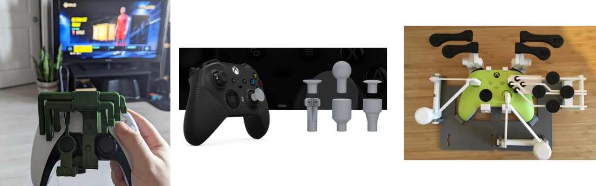
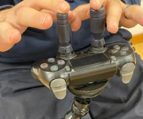
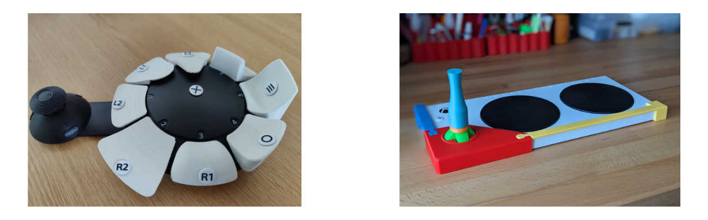
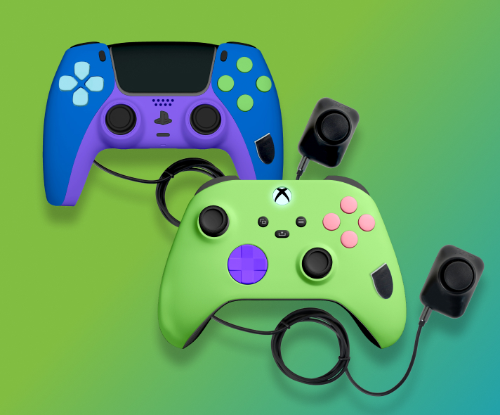
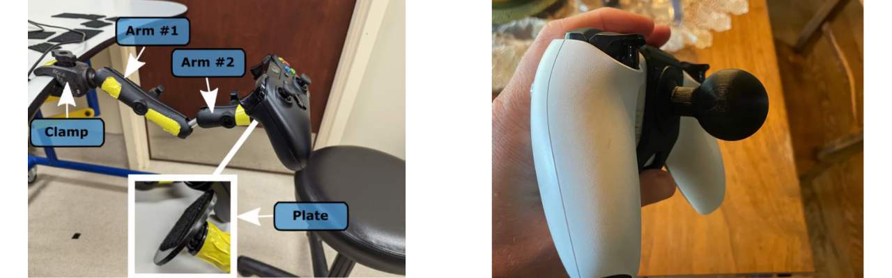

# Controller Modifications

<button onclick="window.print()" class="print-button">
  Printable Version of this Section
</button>

Various Controller Mods

## What are Controller Modifications?
Controller modifications involve altering a standard commercial controller to better suit a player's physical needs. This can range from "non-invasive" changes, like snapping on 3D printed extensions, to "invasive" hardware hacks where the controller is opened up to add new input ports. Whether you are adding a 3D printed grip, mounting the device for stability, or purchasing a professionally modded unit, these adjustments bridge the gap between standard hardware and a player's unique range of motion.

## 3D Printed Modifications
3D printing has revolutionized alternative access by allowing for low-cost, highly customizable physical interfaces. There is a vast library of open-source designs available that can be printed and attached to existing controllers without requiring any permanent changes to the electronics.

Places to Find Controller Mods
 

| Device/Organization | Description |  Link |
| :--- | :--- | :--- |
| **Makers Making Change** | • Range of one handed, thumbstick, and other controller mods. • Can be requested from volunteer makers. • You can access the files to make yourself or request a device. | [Makers Making Change Assistive Device Library](https://www.makersmakingchange.com/assstive-devices) |
| **The Controller Project** | • Supplying free controller modifications to gamers with disabilities or limb differences for many years. • You can access the files to make yourself or request a device. | [The Controller Project Site](https://thecontrollerproject.com/) |

### One Handed Controllers
One-handed 3D printed adapters are among the most popular modifications. These mechanical rigs allow a player to access both analog sticks and all shoulder buttons using a single hand, often by resting the controller on a thigh or table to move the secondary stick via tilting. 

Check out a one handed Mod in action:

    <iframe src="https://www.youtube.com/embed/d1hht2D5cvE?si=Eyw5QdmzoxlKt_2p" frameborder="0" allowfullscreen></iframe>

Most one handed mods are made by a designer named Akaki. He has open sourced some of his designs but also sells them on his website directly. These cost approximatly $10 to 3D print at a local library or through our Makers Making Change program and $235+ if you buy from Akaki directly. If you want to buy them directly and not build them yourself or work with a volunteer, please view his website. Here is a list of current one handed modifications.

Akaki One Handed Controller Mods
 

| Controller | Open Source Files |  Akaki Controller Website |
| :--- | :--- | :--- |
| **Xbox Series X\|S** | [Open Source Files](https://www.makersmakingchange.com/product/onehanded-controller-modification-for-xbox-series-xs/01tJR000000690TYAQ) | [Akaki Website](https://akaki.co/products/one-handed-xbox-series-xs-29039) |
| **Xbox One** | [Open Source Files](https://www.makersmakingchange.com/product/onehanded-xbox-one-controller-modification/01tJR0000009St7YAE) | [Akaki Website](https://akaki.co/products/one-handed-xbox-one-37695) |
| **DualSense (PS5)** | [Open Source Files](https://www.makersmakingchange.com/product/onehanded-controller-modification-for-ps5/01tJR000000690SYAQ) | [Akaki Website](https://akaki.co/products/one-handed-dualsense-70655) |
| **DualShock 4 (PS4)** | [Open Source Files](https://www.makersmakingchange.com/product/onehanded-controller-modification-for-ps4/01tJR000000690MYAQ) | [Akaki Website](https://akaki.co/products/one-handed-dualshock-4-15138) |
| **Nintendo Switch 1** | N/A - Has not open sourced these designs | [Akaki Website](https://akaki.co/collections/products-for-nintendo-switch) |
| **Nintendo Switch 1** • This is not an Akaki design | [Open Source Files - Left Hand](https://www.makersmakingchange.com/product/lefthanded-grip-controller-modification-for-joycon/01tJR000000690RYAQ) [Open Source Files - Right Hand](https://www.makersmakingchange.com/product/righthanded-grip-controller-modification-for-joycon/01tJR000000690VYAQ) | N/A |

???+ note "Adoption Rates"
  While powerful, one handed mods have a steep learning curve. Users often find they require significant practice to master the coordinated movements needed for modern games. For the players they work for, they work great.
  

### Thumbstick Toppers
Thumbstick toppers are also a commonly requested controller mod. Xbox has even identified this and made their own website where a player can customize a thumbstick topper and get a 3D print file. Here are some common resources we use when looking for thumbstick toppers.

    
    
Thumbstick Toppers From Thumb Soldiers

Collection of Thumbstick Mods
 

| Thumbstick Topper Option | Description |  Link |
| :--- | :--- | :--- |
| **Xbox Adaptive Thumbstick Toppers** | • Compatible with standard Xbox One, Xbox Series X\|S, Elite, and Adaptive Joystick Controllers • Allows for customization of a range of toppers. Will give you a free 3D print file (.STL) that you can print them yourself or bring to a local 3D print vendor, possibly local library, or organization like Makers Making Change to print for you. | [Xbox Adaptive Thumbstick Site](https://xboxdesignlab.xbox.com/en-ca/accessories/adaptive-thumbstick-toppers-for-xbox-controllers) |
| **Thumb Soldiers** | • Commercial thumbstick toppers for sale | [Thumb Soldiers Site](https://thumbsoldiers.com/collections/accessibility/products/orbitalls-kit) |
| **ActiveB1t Thumbsticks** | • Open Source selection of 3D printed toppers for a range of controllers. • Download the files and print them yourself or bring to a local 3D print vendor, possibly local library, or organization like Makers Making Change to print for you. | [ActiveB1t Printables Page](https://www.printables.com/model/1002274-thumbstick-topper-system-for-multiple-controllers/files) |
| **AbleGamers Thumbstick Adapters** | • Open Source selection of 3D printed toppers for a range of controllers. • Download the files and print them yourself or bring to a local 3D print vendor, possibly local library, or organization like Makers Making Change to print for you. | [AbleGamers Printables Page](https://www.printables.com/model/989346-xbox-thumbstick-extension-system-accessibility) |
| **Caleb Kraft Thumbstick Adapters** | • Open Source selection of 3D printed toppers for a range of controllers. • Download the files and print them yourself or bring to a local 3D print vendor, possibly local library, or organization like Makers Making Change to print for you. | [Caleb's Thingiverse Page](https://www.thingiverse.com/thing:658420) |

### Modifying Adaptive Controllers
It isn't just standard controllers that can be modded; adaptive hardware can also be customized. Here are a few modifications as an example:

    
    
SAC Button Modifications (left) and XAC Joystick Modification (right)

* **Sony Access Controller (SAC):** Many makers have designed custom "toppers" for the stick and unique button shapes to help players with specific grip requirements. The team that made the Sony Access Controller made a ["3D printing Guide"](https://www.playstation.com/en-ca/support/hardware/access-specifications/) with the specifications a designer would need to make custom joystick toppers and button caps. 
  * Designer, [Harakan on Printables](https://www.printables.com/@Harakan_1552161) made various joystick and button cap toppers for the SAC. 
* **Xbox Adaptive Controller (XAC):** Custom 3D printed knobs (like goals posts or large spheres) can be added to the joysticks used with the Xbox Adaptive Controller to accommodate different hand functions.
  * Designer, [Atom on Printables]https://www.printables.com/model/255246-d-pad-joystick-clip-for-xbox-adaptive-controller) made a joystick that can snap onto the XAC to modify the way a user would interact with the D-Pad.

## Commercial Modifications
For players who want a professional, "out-of-the-box" solution, several companies specialize in modifying controllers for accessibility. 
* **[Evil Controllers:](https://www.evilcontrollers.com/accessible-gaming)** They are a primary leader in this space, offering one-handed versions of the PS5, Xbox Series X, and Nintendo Switch controllers. These often feature re-routed buttons and analog sticks placed on the back of the controller for easier access.

    
    
Evil Controllers One-Handed PS5 and Xbox Series X\|S Controllers

## DIY Modifications
If a 3D printed part or commercial controller isn't a perfect fit, DIY materials offer a way to create a completely bespoke interface. Here is a common method we use.
* **Moldable Plastic (Instamorph):** This is a lightweight thermoplastic that becomes moldable in hot water and hardens into a strong plastic when cool. It is excellent for creating custom-molded finger grips, enlarging small buttons, or creating a personalized joystick topper that fits the exact contour of a player's hand.

    
    
Spruce Joystick Topper and Xbox Controller with Moldable Plastic Added

## Mounting a Controller
A controller modification is only effective if the controller stays in the right place. Mounting provides the stability needed for players who cannot hold a controller's weight or who use 3D printed one-handed rigs.
* **RAM Mounts:** A modular ball-and-socket system that can securely hold a controller in any orientation. Many 3D printed mods include a "RAM Ball" base specifically for this purpose.
* **Hook and Loop (Velcro):** Industrial-strength Velcro can be used to secure a controller to a lap tray or desk, ensuring it doesn't slide away during intense sessions.

**See the [Mounting Section in Alt Access](alt-access.md#mounting) for more information.**

    
    
Hook and Loop on a flat plate using RAM Arms (left) and AbleGamers 3D print RAM Attachment to Controllers (right)

