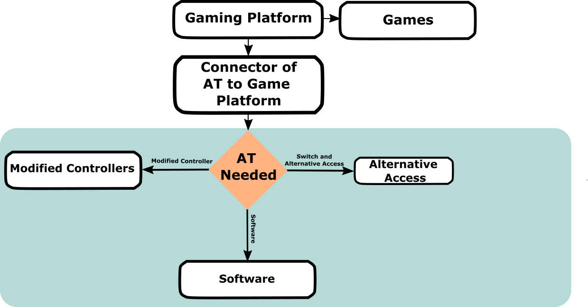

# Equipment Overview
<button onclick="window.print()" class="print-button">
  Printable Version of this Section
</button>

## How do I Know What I am Looking for?
There is plenty of assistive technology out there for adaptive gaming. Often times there is an overwhelming amount of options and it requires a combination of tools. This can be intimidating. This set of resources may seem overwhelming, but take the approach of determing what you are **NOT** interested in for yourself or the client you are working with. Put everything else on the "maybe" list and then begin evaluating the simplest option. 

In general, there are three main ways to make adaptive gaming accessible:

1. Alternative Access
2. Controller Modifications
3. Software

# Getting Started: Choosing Your Access Path

Whether you are a player looking for a personal setup or a clinician supporting someone else, the goal is the same: **maximize the player's existing access.** Use these two questions to decide which sections of this resource to explore first.

    

        <h3>1. Standard Controller Use</h3>
        
Can the player use a standard controller, even if only partially (e.g., just one side or specific buttons)?

        <ul>
            <li><strong>If Yes:</strong> Start with <a href="../control-mods">Controller Modifications</a>. You can often add 3D-printed parts or purchase controller modifications to make a standard controller more accessible.</li>
            <li><strong>If No:</strong> Jump to <a href="../alt-access">Alternative Access</a>. This shows you how to build a custom setup using tools like assistive switches, joysticks, and more.</li>
        </ul>
    

    

        <h3>2. Sensory and Cognitive Needs</h3>
        
Are there barriers related to vision, hearing, or how information is processed?

        <ul>
            <li><strong>If Yes:</strong> Explore <a href="../software">Software Features</a> first. There may be in-game accessibility or additional softwares that might make gaming more accessible for the player.</li>
        </ul>
    

### The "Abilities-First" Strategy

We don't focus on what a player *cannot* do. Instead, we identify every reliable movement a player **can** make and turn those into game inputs.

**Case Study: The Hybrid Setup**
Consider a player who has full use of their left hand but limited movement on their right.

1.  **The Base:** We might start with a [Controller Modification](control-mods.md) like a one-handed controller.
2.  **The Supplement:** If certain buttons are still hard to reach, we don't give up on that controller. We add a "Hybrid" element—perhaps a [Assistive Switch](alt-access.md) or [voice command](Software.md)—to handle the missing actions.

**Pro Tip:** Great setups are rarely one-size-fits-all. They are often a mix of hardware "hacks" and software settings.

## Flow chart for Deciding What Route to Take
Before deciding on what three methods of making the game accessible you choose, you should consider both the game and gaming system/platform that you are going to be playing on. The assistive technology required to play a simple game on a phone is much different than playing a complex game on a PlayStation system.

    
    
General Flow for Approcahing Customizing a Setup

