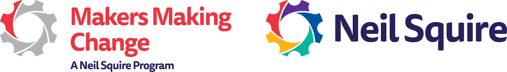

# Welcome to Adaptive Gaming

<button onclick="window.print()" class="print-button">
  🖨️ Print This Section Only
</button>

## Why Adaptive Gaming Matters

Gaming is the largest entertainment industry in the world, providing vital spaces for entertainment, careers, and community. However, accessibility challenges remain a significant barrier for many. 

For the **31% of gamers who live with a disability**, adaptive gaming is life-changing:
* **Rehabilitation:** It gamifies physical and cognitive therapy. 
* **Social Connection:** It reduces isolation by connecting players to global communities.
* **Independence:** It increases autonomy through digital participation.

Makers Making Change ensures the community has access to these benefits by providing open-source assistive technology at about **one-tenth the cost** of commercial devices.

## Program Overview

<iframe width="560" height="315" src="https://www.youtube.com/embed/K66lpzpTknA" frameborder="0" allowfullscreen></iframe>

  
  
Scan to watch: Adaptive Gaming Overview Video

## Your Pathway to Play

This resource guides clinicians, makers, and gamers through the adaptive gaming journey:

1.  **Adaptive Equipment:** Explore [Alternative Access](alt-access.md), [Controller Modifications](control-mods.md), and [Software Features](video-game-accessibility.md).
2.  **Gaming Basics:** Learn [How to Pick Games](pick-game.md) and build [Video Game Literacy](video-game-literacy.md).
3.  **Best Practices:** Follow our [Session Walkthrough](session-walkthrough.md) for successful assessment and setup.
4.  **Clinical Tools:** Access [Questionnaires](questionnaire.md), [Equipment Lists](equipment-lists.md), and [Templates](templates.md).

Check out the official [GAME Checkpoints Program](https://www.makersmakingchange.com/game-checkpoint-program).

  
  
Link: Visit the GAME Checkpoints Webpage

---

    
    
Want to learn more about this program or request a device?

    <a href="https://www.makersmakingchange.com/" 
       class="mmc-footer-button" 
       target="_blank" 
       rel="noopener">
        Visit Makers Making Change
    </a>

