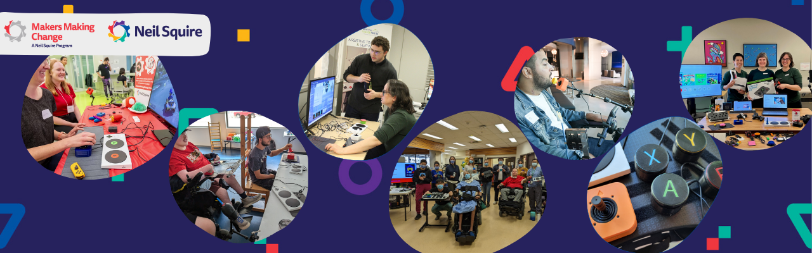

# Welcome to Adaptive Gaming

<button onclick="window.print()" class="print-button">
  Printable Version of this Section
</button>

## What is this Resource?
Welcome! This resource is a collection of the [Makers Making Change](https://www.makersmakingchange.com/), a program of [Neil Squire](https://www.neilsquire.ca/), adaptive gaming resources. Intended for both or GAME Checkpoint community or anyone in the world interested in learning more about assistive technology in gaming. This resource assumes you are already familiar with the disability of someone else you are working with or you are reading this to learn about the assistive technology out there that you can use.

  
  
Link: Makers Making Change site

  
  
Link: Neil Squire site

## Your Pathway to Play

If you do not know where to start, follow the path below to get a deep understanding of the equipment, video game literacy, and best practices around adaptive gaming:

1.  **Adaptive Gaming Equipment:** Explore [Alternative Access](alt-access.md), [Controller Modifications](control-mods.md), and [Software Features](software.md).
2.  **Video Game Basics:** Learn [How to Pick Games](pick-game.md) and build [Video Game Literacy](video-game-literacy.md).
3.  **Best Practices:** Follow our [Session Walkthrough](session-walkthrough.md) for a successful assessment and setup. View [Tips and Tricks](tips-and-tricks.md) that we have developed or learned through the years at Makers Making Change.
4. **[Gamer Profiles:](profiles.md)** Check out the setups of various individuals to get insight into how this can apply to yourself or client.

### Other Resources found on this site

1.  **GAME Checkpoint Resources:** Are you a centre that is looking for resources to help you serve your community? This section allows you to access [Questionnaires](questionnaire.md), [Equipment Lists](equipment-lists.md), [Marketing and Posters](marketing.md), and various [Templates](templates.md).
2. **[Get Support:](support.md)** Check out this section to find out how to get in contact with us.
3. **[Download/Print:](print.md)** Visit this page if you would like to print a static version (.PDF) of everything included on this site. The video and linked sections will be turned into QR codes.

    
    
put a graphical representation of the breakdown of content

## Why Adaptive Gaming Matters

Gaming is the largest entertainment industry in the world, providing a vital space for entertainment, careers, and community. However, accessibility challenges often remain a barrier to full participation.

For the 31% of gamers who live with a disability, adaptive gaming is life-changing:

* **Social Connection:** It reduces isolation by connecting players to a global community.
* **Independence:** It increases autonomy through digital participation as well as familiarty with assistive technology that can be used for digital access.
* **Rehabilitation:** It can be used to gamify physical and cognitive therapy sessions.

Makers Making Change works to ensure the disability community can fully participate by providing open-source assistive technology at about one-tenth the cost of similar commercial devices.

## Makers Making Change - GAME Program Overview

Makers Making Change is leading Canada’s accessible gaming efforts. We’re supporting gamers, makerspaces, clinical centres, and game developers along their adaptive gaming journey. On this page you will find information around our low cost open source gaming assistive technology, resources on accessible gaming basics, R&D developments, and community initiatives.

The [GAME Checkpoints program](https://www.makersmakingchange.com/game-checkpoint-program) is one of our main initiatives that was created o help organizations build accessible gaming spaces that fit their community. Many centres told us they wanted to support gamers with disabilities but needed guidance on equipment, setup, and training. Since 2022, we have worked with clinics, community hubs, schools, and game developers to create welcoming spaces where gamers with disabilities can explore adaptive gaming and find the equipment that works best for them.

  
  
Link: Visit the GAME Checkpoints Webpage

    <iframe src="https://www.youtube.com/embed/K66lpzpTknA" frameborder="0" allowfullscreen></iframe>

  
  
Scan to watch: Adaptive Gaming Overview Video

This resource is intended to be a resource guide and source of useful materials for the GAME Checkpoints as well as individuals looking for more information on adaptive gaming. If you are a GAME Checkpoint leader looking for specific tools, check out the [GAME Checkpoint specific resouces on this site](questionnaire.md). 

