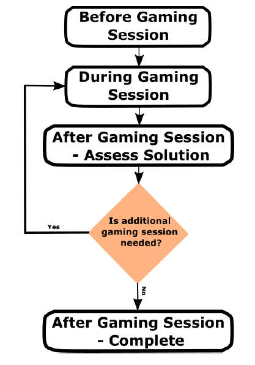
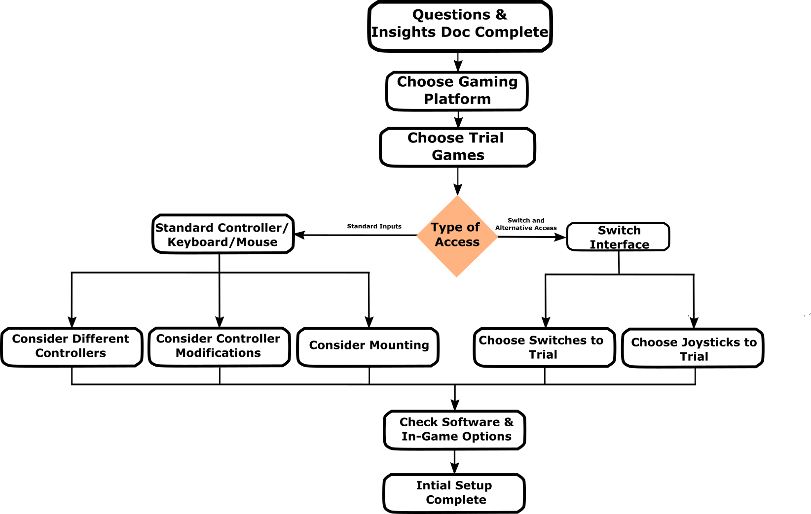
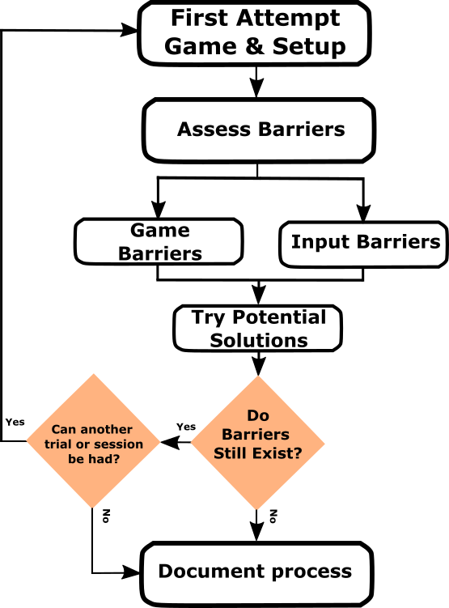
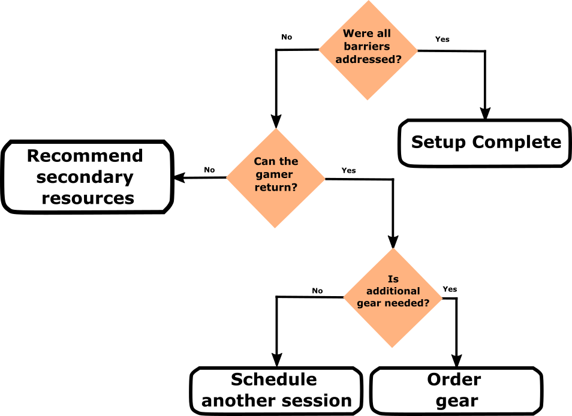
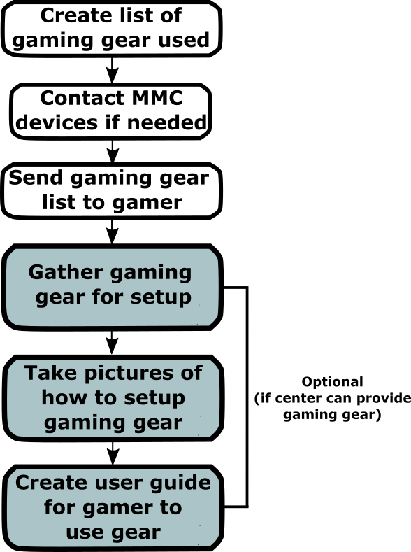

# GAME Session Walkthrough

<button onclick="window.print()" class="print-button">
  Printable Version of this Section
</button>

Gaming with assistive technology is a personal journey. There is no one-size-fits-all solution; instead, these best practices serve as a roadmap based on Makers Making Change’s experience working with partners such as the Stan Cassidy Centre for Rehabilitation. This is intended to help a clinician, family member, or player think through trialing adaptive gaming equipment.

---

## The Gaming Session

Trialing adaptive gear before purchase is important for finding a setup that works. While every center operates differently, the following framework provides a flexible guide.

    
    
The Gaming Session - Overview

General Session Breakdown
 

| GAME Session Step | Why | Tool/Resource |
| :--- | :--- | :--- |
| 1. Before | Gather user information and prepare initial solutions | [Gamer Questionnaire](questionnaire.md) |
| 2. During | Test and adjust equipment and settings | [Equipment Sections](equipment.md) |
| 3. Assess | Evaluate outcomes and determine next steps | [Equipment Sections](equipment.md) |
| 4. Finalize | Document and support setup acquisition | [Support Options](support.md) |

??? warning "These Steps are Flexible."
    Customize this workflow based on your resources and goals.

---

## 1. GAME Session - Before

    
    
The Gaming Session - Before

??? info "Initial Information & Goal Setting"
    **Question:** Has a clear gamer goal been identified?

    ??? "If Yes"
        Focus the session on that goal (specific game, activity, or experience).

    ??? "If No"
        Ask the gamer:
        * What games or genres interest them
        * If they have played before
        * What they want to achieve

        If unsure, start with a simple, low-input game.

??? info "Choose Gaming Platform"
    **Question:** Is the preferred gaming system known and available?

    ??? "If Yes"
        Use their preferred or most-used system.

    ??? "If No"
        Determine preference:
        * Ask what system they want to use
        * Consider where their friends play
        * Consider types of games

        If unavailable:
        * Try a similar system
        * Use adapters where possible
        * Choose the system that best fits the trial

??? info "Choose Trial Game(s)"
    **Question:** Has an appropriate trial game been selected?

    ??? "If Yes"
        Ensure the game:
        * Matches their goal or genre
        * Has manageable input requirements
        * Has a low-stress entry point (tutorial, freeplay)

    ??? "If No"
        Select a game by:
        * Matching genre or goal game
        * Starting with fewer inputs if needed
        * Choosing slower-paced or simpler games

        If needed:
        * Start simple → progress toward goal game

??? info "Choose Type of Access"
    **Question:** Has an appropriate controller or access method been selected?

    ??? "If Yes"
        Prepare options such as:
        * Standard or modified controllers
        * Switch interface setups
        * Alternative inputs (mouth joystick, etc.)

    ??? "If No"
        Determine based on ability:
        * Try standard controller to assess barriers
        * Try switch interface if needed
        * Consider mounting or alternative layouts

??? info "Additional Hardware & Setup"
    **Question:** Is the setup prepared and stable?

    ??? "If Yes"
        Confirm:
        * Equipment is available
        * Game is ready to launch
        * Mounting solutions are stable

    ??? "If No"
        Prepare:
        * Mounts (RAM, trays, Velcro)
        * Controllers and adapters
        * Game updates and starting point

---

## 2. GAME Session - During

    
    
The Gaming Session - During

??? info "Try Initial Setup"
    **Question:** Can the user successfully begin interacting with the game?

    ??? "If Yes"
        Move into gameplay and observe performance.

    ??? "If No"
        Identify the issue:
        * Navigation difficulty
        * Physical access issue

        Adjust:
        * Button mapping
        * Positioning
        * Provide guidance if needed

??? info "Identify Barriers and Difficulties"
    **Question:** Are barriers present during gameplay?

    ??? "If Yes"
        Identify type of barrier:

        * **Game-related**
            * Adjust difficulty or settings
            * Try different modes
            * Try a different game if needed

        * **Controller-related**
            * Change layout or mapping
            * Try different hardware
            * Adjust switches or joysticks
            * Consider mounting or alternative inputs

    ??? "If No"
        Continue gameplay and validate consistency across actions

??? info "Fatigue & Frustration Check"
    **Question:** Is the user experiencing fatigue or frustration?

    ??? "If Yes"
        * Pause the session
        * Reduce effort required (force, positioning)
        * Take breaks

    ??? "If No"
        Continue session while monitoring comfort

??? info "Make Record of Setup"
    **Question:** Has the setup been documented?

    ??? "If Yes"
        Ensure documentation includes:
        * Equipment used
        * Layout and positioning
        * Game settings

    ??? "If No"
        Record:
        * What worked and what didn’t
        * Photos of setup
        * Notes on barriers and solutions

---

## 3. GAME Session - Assess

    
    
The Gaming Session - Assess

??? info "Assess the Solution"
    **Question:** Did the setup meet the gamer’s goal?

    ??? "If Yes"
        Move forward with finalizing the setup.

    ??? "If No"
        Determine next steps:
        * Schedule another session if possible
        * Identify additional equipment to try
        * Document remaining barriers

??? info "Identify Additional Needs"
    **Question:** Are additional resources or equipment required?

    ??? "If Yes"
        Consider:
        * New hardware options
        * Different game approaches
        * External support resources

    ??? "If No"
        Proceed to finalize the setup

??? info "Provide Resources"
    **Question:** Does the user need external support or resources?

    ??? "If Yes"
        Share:
        * Makers Making Change
        * AbleGamers
        * Funding options (if applicable)

    ??? "If No"
        Continue with final setup planning

---

## 4. GAME Session - Finalize

    
    
The GAME Session - Finalize

??? info "Gaming Setup Equipment List"
    **Question:** Has a full equipment list been created?

    ??? "If Yes"
        Provide:
        * Full list of devices
        * Required accessories
        * Purchase links if possible

    ??? "If No"
        Create list including:
        * All hardware used
        * Setup notes
        * Home setup considerations

??? info "Contact MMC for Open-Source AT"
    **Question:** Does the setup include open-source devices?

    ??? "If Yes"
        Submit request:
        * Include device details
        * Provide notes and photos

    ??? "If No"
        Proceed with commercial options

??? info "Send Information to User"
    **Question:** Has the user received all setup information?

    ??? "If Yes"
        Confirm understanding of:
        * Setup process
        * Required settings
        * Equipment sourcing

    ??? "If No"
        Provide:
        * Equipment list
        * Setup photos
        * Settings and instructions

??? info "Follow-Up or Delivery"
    **Question:** Is additional support required?

    ??? "If Yes"
        Consider:
        * Follow-up session
        * Setup guide with images
        * Equipment delivery or setup support

    ??? "If No"
        Ensure user can independently set up and use their system