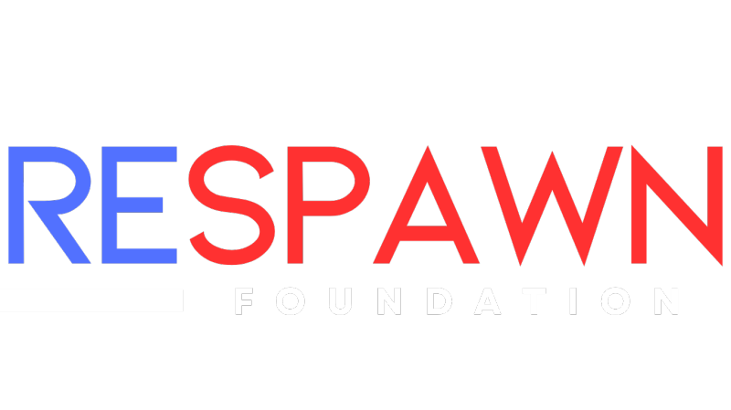

# Get Support

<button onclick="window.print()" class="print-button">
  Printable Version of this Section
</button>

Are you looking for support as either a clinician or an individual looking to get into adaptive gaming? Use the filters below to find relevant organizations.

---

## Filter by Audience

  <label class="filter-option">
    <input type="checkbox" value="player" onchange="applyFilters()">
    Player/Individual
  </label>

  <label class="filter-option">
    <input type="checkbox" value="clinician" onchange="applyFilters()">
    Clinician
  </label>

---

<!-- Makers Making Change Section -->

  

  

    <h3><a href="https://www.makersmakingchange.com/">Makers Making Change</a></h3>

    

      <strong>Audience:</strong> Player, Clinician 
      <strong>Location:</strong> Canada / Global
    

    <ul>
      <li>Hosts a library of open-source assistive technology, including devices for gaming such as assistive switches, joysticks, controller mods, and switch interfaces. Focus on low-cost solutions.</li>
      <li>Focus in Canada; however, resources and designs for assistive technology are publicly available for free.</li>
      <li>Provides resources (this site and more) for adaptive gaming focused on clinicians, organizations, and players.</li>
      <li>The <a href="https://www.makersmakingchange.com/game-checkpoint-program">GAME Checkpoints program</a> supports organizations, rehab hospitals, and community centres to obtain adaptive gaming gear and provide training.</li>
      <li>Allows players, families, or clinicians to submit a <a href="https://www.makersmakingchange.com/create-a-gaming-ticket">GAME Ticket</a> that connects them with the adaptive gaming team for personalized support. Conducts in-home or remote assessments to trial and configure gaming equipment.</li>
      <li>The <a href="https://www.makersmakingchange.com/game-kit-landing-page">GAME Kits</a> are the ultimate solution for adaptive gaming gear and assistive technology, designed for organizations looking to showcase video game accessibility. This comprehensive kit includes everything you need, plus a step-by-step guide to set up adaptive gaming events and showcases in your community.</li>
    </ul>
  

---

<!-- SpecialEffect Section -->

  

  

    <h3><a href="https://www.specialeffect.org.uk/">SpecialEffect</a></h3>

    

      <strong>Audience:</strong> Player 
      <strong>Location:</strong> United Kingdom / Global
    

    <ul>
      <li>Provides 1:1 support for individuals with physical disabilities to find the right gaming setup using a range of assistive technologies. Conducts in-home or remote assessments to trial and configure gaming equipment.</li>
      <li>Creates and manages a fantastic website of adaptive gaming reaources called <a href="https://gameaccess.info/">GameAccess</a></li>
      <li>StarGaze project involves the assessment and support of people in intensive care due to a traumatic injury or illness which results in them having very urgent, severe and complex physical challenges.</li>
      <li>Shares publicly available resources and case studies that demonstrate real-world adaptive gaming solutions.</li>
      <li>Collaborate directly with hardware and software developers</li>
    </ul>
  

---

<!-- AbleGamers Section -->

  

  

    <h3><a href="https://www.ablegamers.org/">AbleGamers</a></h3>

    

      <strong>Audience:</strong> Player 
      <strong>Location:</strong> United States / Global
    

    <ul>
      <li>Provides direct support to gamers with disabilities through the AbleGamers Peer Counseling program.</li>
      <li>Offers guidance on equipment selection, setup, and game accessibility options.</li>
      <li>Develops resources and training for both players and industry on accessible game design.</li>
    </ul>
  

---

<!-- Respawn Foundation Section -->

  

  

    <h3><a href="https://www.respawnfoundation.org/">Respawn Foundation</a></h3>

    

      <strong>Audience:</strong> Clinician 
      <strong>Location:</strong> United States
    

    <ul>
      <li>Works with rehabilitation hospitals and clinicians to integrate adaptive gaming into therapy and recreation programs.</li>
      <li>Provides training, guidance, and program development support for clinical teams.</li>
      <li>Supports research and evidence-building around adaptive gaming in clinical settings.</li>
      <li>Collaborates with organizations to implement structured adaptive gaming programs.</li>
    </ul>
  

---

<!-- FlyLilo Section -->

  

  

    <h3><a href="https://www.flylillo.com/en/">FlyLilo</a></h3>

    

      <strong>Audience:</strong> Player 
      <strong>Location:</strong> Global
    

    <ul>
      <li>Provides a community-focused platform for gamers with disabilities to connect, share setups, and learn from each other.</li>
      <li>Offers content, guides, and examples of adaptive gaming configurations.</li>
      <li>Focus on peer-driven knowledge sharing rather than formal clinical support.</li>
      <li>Helps players discover new equipment, games, and strategies through community experiences.</li>
      <li>Useful for exploring real-world setups and gaining ideas before trialing equipment.</li>
    </ul>
  

---

<!-- AT Act Program Section -->

  

  

    <h3><a href="https://at3center.net/state-at-programs/">USA-Based AT Act Programs</a></h3>

    

      <strong>Audience:</strong> Player, Clinician 
      <strong>Location:</strong> United States (State-Based)
    

    <ul>
      <li>Federally funded programs available in every U.S. state to support access to assistive technology.</li>
      <li>Often provide device loan programs, allowing users to trial equipment before purchasing.</li>
      <li>May offer funding support, reutilization programs, and equipment demonstrations.</li>
      <li>Services vary by state, so local program offerings should be reviewed individually.</li>
    </ul>
  

