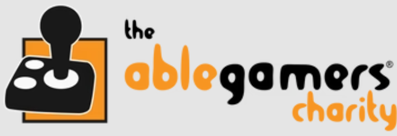
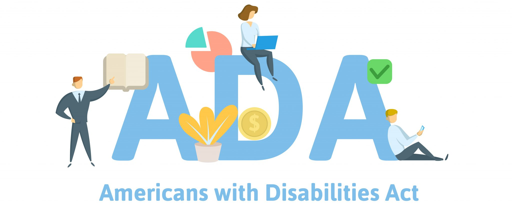

# Get Support

<button onclick="window.print()" class="print-button">
  Printable Version of this Section
</button>

Are you looking for support as either a clinician or an individual looking to get into adaptive gaming? Use the filters below to find relevant organizations.

---

## Filter by Audience

  <label class="filter-option">
    <input type="checkbox" value="player" onchange="applyFilters()">
    Player/Individual
  </label>

  <label class="filter-option">
    <input type="checkbox" value="clinician" onchange="applyFilters()">
    Clinician
  </label>

---

  

  

    <h3>Makers Making Change</h3>

    

      <strong>Audience:</strong> Player, Clinician 
      <strong>Location:</strong> Canada / Global
    

    

      Provides open-source assistive technology, device builds, and programs to support accessible gaming and daily living. Focus on low-cost solutions and community-based builds.
    

  

---

  

  

    <h3>SpecialEffect</h3>

    

      <strong>Audience:</strong> Player 
      <strong>Location:</strong> [Add Location]
    

    

      [Add description]
    

  

---

  

  

    <h3>AbleGamers</h3>

    

      <strong>Audience:</strong> Player 
      <strong>Location:</strong> [Add Location]
    

    

      [Add description]
    

  

---

  

  

    <h3>Respawn Foundation</h3>

    

      <strong>Audience:</strong> Player, Clinician 
      <strong>Location:</strong> [Add Location]
    

    

      [Add description]
    

  

---

  

  

    <h3>FlyLilo</h3>

    

      <strong>Audience:</strong> Player 
      <strong>Location:</strong> [Add Location]
    

    

      [Add description]
    

  

---

  

  

    <h3>USA-Based AT Act Programs</h3>

    

      <strong>Audience:</strong> Player, Clinician 
      <strong>Location:</strong> [Add Location]
    

    

      [Add description]
    

  

